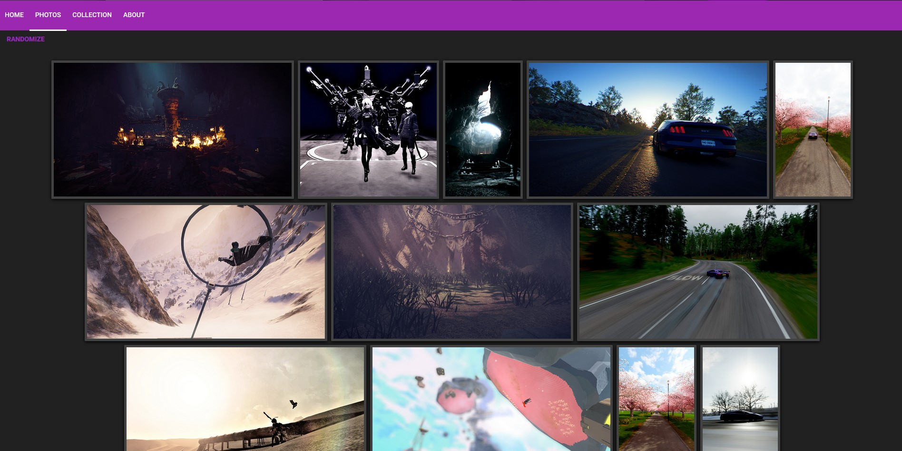

# Artistic Portfolio

A basic symfony 4.x project using Flickr's API (useful for saving space on free webhosts lol)  
Don't forget to do a ```composer update``` on the terminal to get all the dependencies.  
Don't forget to check the web-release branch if you're planning to upload it

All you need to do to make it work is to create a file in ```public/``` named ```apiKey.php```  
Just type the following with your API key [(Get it here)](https://www.flickr.com/services/apps/create/apply/) and your user id (you can found it on your profile's URL)

``` php
<?php
define('apiKey', 'your api key here');
define('userId', 'user@id');
?>
```

If you made a custom adress, just copy/paste this on your navigator with your API key and your username and get the nsid :

``` php
"https://api.flickr.com/services/rest/?method=flickr.people.findByUsername&api_key=[apiKey]&user_id=[username]&format=json&nojsoncallback=1"
```

## Parameters

Can be modified in the ```PhotosController.php``` file

``` php
    const darkMode = 1;             //Dark mode On/Off
    const themeColor = "#9C27B0";   //Theme color, don't forget to change the text color in css if it's too luminous
    const maxPhotosPerPage = 100;   //Number of photos to show per page, maximum is 500
```

## Example

